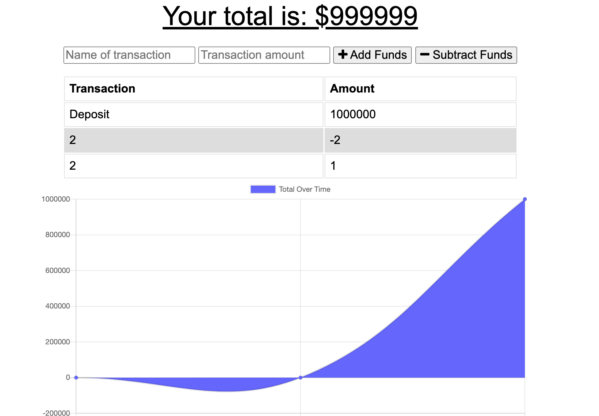

# Budget App 💵


### Desription

The user will be able to add expenses and deposits to their budget with or without a connection. When entering transactions offline, they should populate the total when brought back online.

Offline Functionality:

Enter deposits offline

Enter expenses offline

When brought back online:

Offline entries should be added to tracker.



 
  
### Deployed Link
    
 https://guarded-journey-92358.herokuapp.com/ 


### Installation
```
Npm i - to install all dependencies 
```

### Technologies Used:
 - JavaScript
 - MongoDB
 - Mongoose
 - Express
 - Node.js
 - PWA - with the use of a service worker